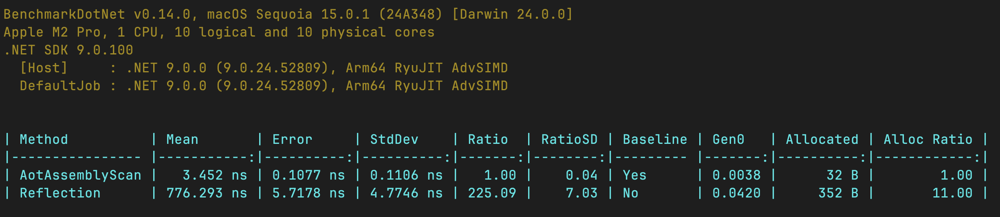
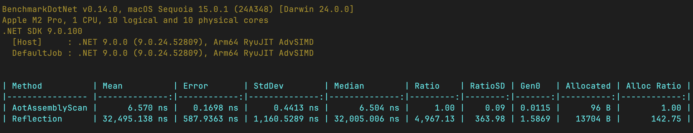

# AotAssemblyScan
AotAssemblyScan is a library
designed to enhance assembly scanning by leveraging source generators instead of traditional C# reflection. 
It streamlines the process of discovering types in assemblies, improving performance and flexibility.

# How to use
Using the library is straightforward. Here's how:
1. Add a nuget package
   ```shell
   dotnet add package AotAssemblyScan
   ```
2. Define a partial method and annotate it with the `[AssemblyScan]` attribute.
3. Add other attributes to filter the types based on your requirements.

Example:
```csharp
using AotAssemblyScan;

public static partial class AssemblyUtils
{
    [AssemblyScan]
    [IsInterface(false), IsAbstract(false)]
    [HasAttribute<MarkerAttribute>, HasAttribute<Marker2Attribute>]
    [IsAssignableTo<IMarkerInterface>, IsAssignableTo<IMarkerInterface2>]
    public static partial IReadOnlyList<Type> GetMarkedTypes();
}
```

For more details, check out the [sample project](samples/AotAssemblyScan.Sample).

# Limitations
To ensure source code generation, your method must meet certain criteria. 
If these aren’t followed, the generator will not produce any output.

## Signature
- The method must be non-generic and accept no parameters.
- It must return one of the following types:
  - `IEnumerable<Type>`
  - `IReadOnlyList<Type>`
  - `ICollection<Type>`
  - `IList<Type>`
  - `Type[]`

## Selection criteria
Currently, the library offers several filters to fine-tune your assembly scanning:

### `[IAssignableTo<T>]`
Includes types that are assignable to the specified type T.
The type must either inherit from T, implement T if it's an interface, or be T itself.

### `[HasAttribute<T>]`
Includes types that have the specified attribute T.

### `[IsInterface(isInsterface = true | false)]`
Includes types based on whether they’re interfaces.
Set isInterface to true to include interfaces, or false to include only non-interface types.

### `[IsAbstractClass(isAbstractClass = true | false)]`
Includes types based on whether they’re abstract classes.
Set isAbstractClass to true for abstract types and false for non-abstract types.

# Benchmarks
This benchmark is available in the repository
and compares AotAssemblyScan against traditional reflection.
Here are the results:



This benchmark was conducted in a project with over 40,000 lines of code that we run in production.
Although the exact code can’t be shared, the results highlight the library’s real-world performance.
Hope, I’ll be running more benchmarks
using a large open-source project to see how AotAssemblyScan holds up in different environments.


